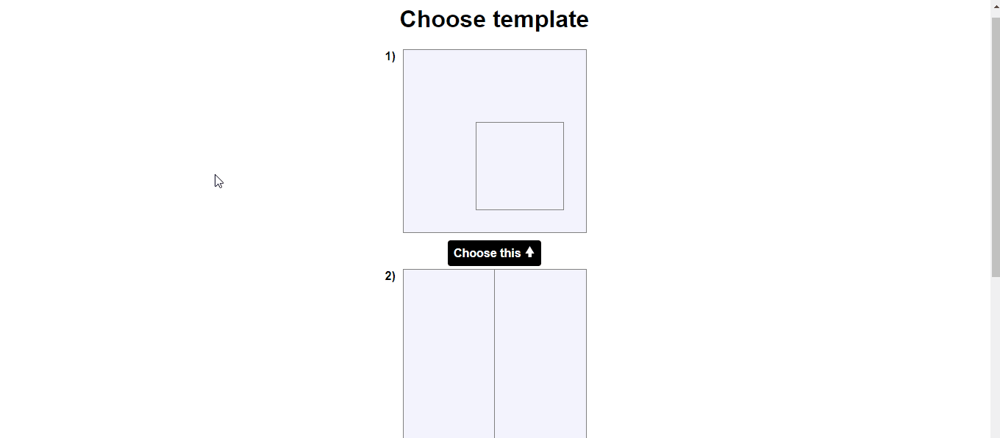

### A photo collage maker

## Demo

### setup

Typescript files are located in the `src` folder while the transpiled `Javascript` files are in the `dist` folder.
The typescript version used is `4.1.3`
All the configurations are in the `tsconfig.json` file

### Instructions

Open the `index.html` file and choose a template for the collage then you'll be redirected where you can preview and/or
download the generated collage.
